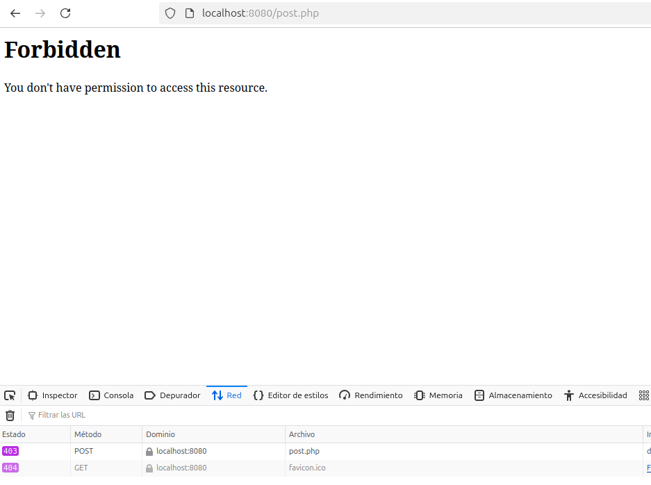

## Desplegar contenedor docker
Para desplegar este contenedor necesitoamos realizar los siguientes comandos:

1. **Construir la imagen Docker**:
   ```sh
   docker build -t pps/apache-modsecurity  -f Dockerfile .
   ```
2. **Ejecutar el contenedor**:
   ```sh
   docker run -d -p 8080:80 -p 8443:443 pps/apache-modsecurity
   ```
3. **Comprobar si la política CSP está aplicada**:
   Para comprobar el correcto funcionamiento deberemos de abrir nuestro servidor apache el navegador y hacer un ataque XSS.
   ```html
   <script>alert('XSS')</script>
   ```

Si todo esta bien deberiamos ver una salida similar a la que se muestra en la siguiente captura de pantalla.


