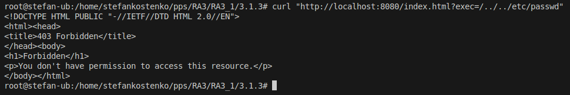

## Desplegar contenedor docker
Para desplegar este contenedor necesitoamos realizar los siguientes comandos:

1. **Construir la imagen Docker**:
   ```sh
   docker build -t pps/apache-owasp  -f Dockerfile .
   ```
2. **Ejecutar el contenedor**:
   ```sh
   docker run -d -p 8080:80 -p 8443:443 pps/apache-owasp
   ```

3. **Comprobar si la política CSP está aplicada**:
   ```sh
   curl "http://localhost:8080/index.html?exec=/../../etc/passwd"
   ```
Si todo esta bien deberiamos ver una salida similar a la que se muestra en la siguiente captura de pantalla. La cual nos devuelve un Forbidden que viene ser lo mismo que el error 403 como en la practica anterior.


