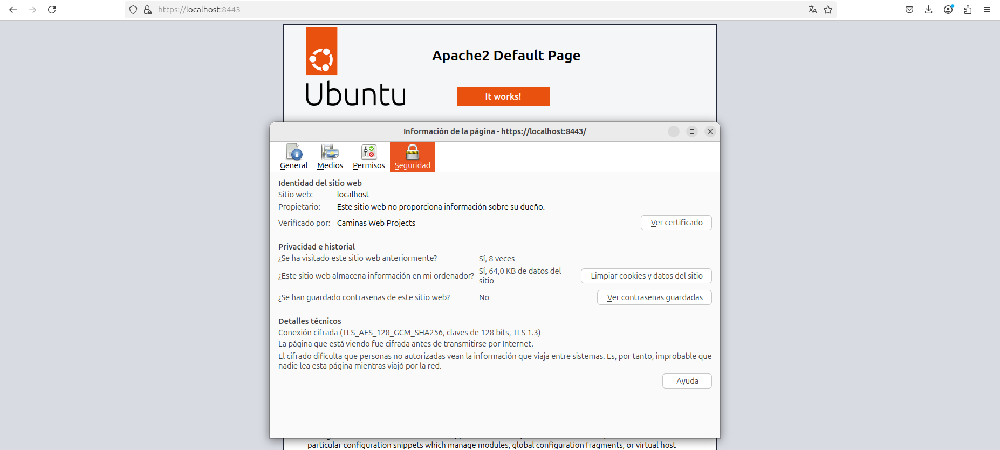
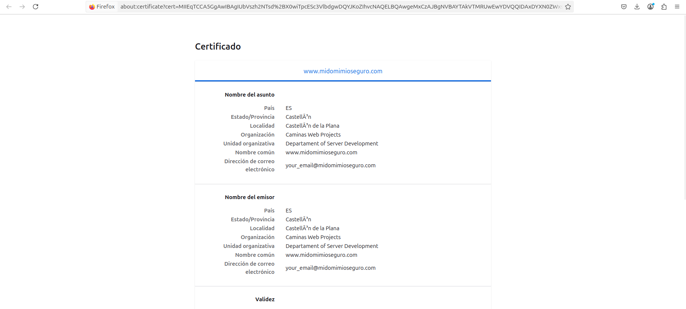

## Desplegar contenedor docker
Para desplegar este contenedor necesitoamos realizar los siguientes comandos:

1. **Construir la imagen Docker**:
   ```sh
   docker build -t pps/apache-certificados  -f Dockerfile .
   ```
2. **Ejecutar el contenedor**:
   ```sh
   docker run -d -p 8080:80 -p 8443:443 pps/apache-certificados
   ```

3. **Comprobar si la política CSP está aplicada**:
Para comprobar si todo esta bien deberiamos poder acceder mdiante [Visitar el sitio seguro](https://localhost:8443) el cual esta firmado con un certificado autofirmado como lo podemos ver en las siguientes capturas de pantalla.



