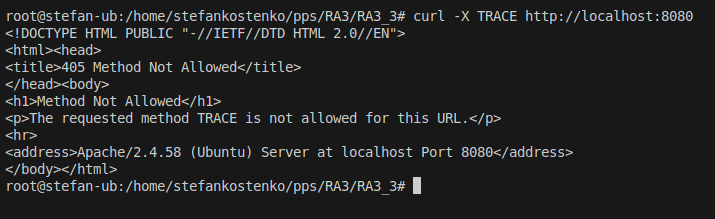

## Desplegar contenedor docker
Para desplegar este contenedor necesitoamos realizar los siguientes comandos:

1. **Construir la imagen Docker**:
   ```sh
   docker build -t pps/apache-best-practices  -f Dockerfile .
   ```
2. **Ejecutar el contenedor**:
   ```sh
   docker run -d -p 8080:80 -p 8443:443 pps/apache-best-practices
   ```

3. **Comprobar si la política CSP está aplicada**:
Para comprobar si todo eta bien vamos a lanzar varias peticiones a nuestro servidor para ver si esta todo bien configurado.

***3.1 En primer lugar vamos a comprobar si hemos podido esconder la version de Apache***

```sh
curl -I http://localhost:8080
```


***3.2 En segundo lugar vamos a comprobar que el listado de directorios está deshabilitado***

```sh
curl -I http://localhost:8080/somefolder/
```


***3.3 Luego vamos a Verificar las cabeceras de seguridad***

```sh
curl -I http://localhost:8080/
```


***3.4 Y por ultimo comprobar que el método TRACE está deshabilitado***

```sh
curl -X TRACE http://localhost:8080
```

